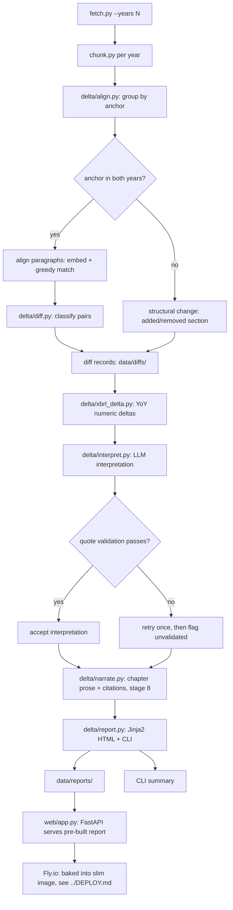

# 00-ARCHITECTURE.md — FinDocQA Delta v2

**Read `../delta_master_blueprint.md` first.** This doc is the build-ready spec: exact contracts, schemas, directory tree, cross-cutting policies. No prose where a signature will do.

---

## 1. Directory tree (v2 target state)

```
FinDocQA/
├── README.md                          # v1 results narrative + project overview
├── DESIGN.md                          # UI design system (unchanged)
├── AGENTS.md / CLAUDE.md              # agent notes (updated for v2)
├── LICENSE                            # MIT
├── Makefile                           # extended with delta + web + deploy targets
├── requirements.txt                   # full dev/pipeline deps
├── requirements-web.txt               # deployed runtime deps only (no torch)
├── Dockerfile / fly.toml              # slim static deploy — see docs/DEPLOY.md
├── docs/
│   ├── delta_master_blueprint.md      # merged source of truth (v1 + v2)
│   ├── DEPLOY.md                      # Fly.io deploy + cost invariant
│   ├── tracker.md                     # progress tracker
│   └── working_knowledge.md           # session bootstrap
├── docs/plan/
│   ├── 00-ARCHITECTURE.md             # this file
│   ├── INDEX.md                       # phase index
│   └── phase-00..05-*.md
├── src/
│   ├── config.py                      # EXTENDED: DELTA_* paths, years, thresholds
│   ├── fetch.py                       # EXTENDED: --years N, multi-year accession loop
│   ├── chunk.py                       # HARDENED: HTML cleaning, size fix, older formats
│   ├── anchors.py                     # UNCHANGED
│   ├── embed.py                       # UPDATED: load_chunks glob for {ticker}_{fy}_*
│   ├── rerank.py                      # UNCHANGED
│   ├── scoring.py                     # UNCHANGED (numeric normalization reused by xbrl_delta)
│   ├── query.py                       # UNCHANGED (v1 RAG CLI)
│   ├── run_eval.py                    # UNCHANGED (v1 eval harness)
│   ├── web_search.py                  # UNCHANGED
│   ├── dashboard.py                   # UNCHANGED (v1 Streamlit)
│   ├── delta.py                       # NEW: CLI entrypoint
│   ├── delta/                         # NEW: Delta pipeline package
│   │   ├── __init__.py
│   │   ├── align.py                   # stage 3-4: section + paragraph alignment
│   │   ├── diff.py                    # stage 5: classification, deltas, churn
│   │   ├── xbrl_delta.py              # stage 6: YoY XBRL deltas
│   │   ├── interpret.py               # stage 7-8: LLM calls, validation
│   │   ├── report.py                  # stage 9: HTML + CLI rendering
│   │   └── prompts.py                 # interpretation + synthesis prompts
│   ├── web/                           # NEW: FastAPI web app
│   │   ├── __init__.py
│   │   ├── app.py                     # FastAPI app factory
│   │   ├── routes.py                  # routes: /, /report/{ticker}, /api/trigger/{ticker}
│   │   ├── templates/
│   │   │   ├── base.html              # DESIGN.md chrome (nav, footer, CSS tokens)
│   │   │   ├── index.html             # hero + ticker input
│   │   │   └── report.html            # Delta change report
│   │   └── static/
│   │       └── css/
│   │           └── tokens.css         # DESIGN.md → CSS custom properties
│   ├── eval/                          # UNCHANGED
│   └── data/
│       ├── raw/                       # EXTENDED: {ticker}_FY{yyyy}_10k.html
│       ├── chunks/                    # EXTENDED: {ticker}_FY{yyyy}_sectionaware.json
│       ├── chroma/                    # UNCHANGED
│       ├── eval/                      # UNCHANGED
│       ├── diffs/                     # NEW: {ticker}/FY{yyyy}_FY{yyyy}.jsonl
│       └── reports/                   # NEW: {ticker}.html
└── tests/
    ├── test_anchors.py                # UNCHANGED
    ├── test_scoring.py                # UNCHANGED
    ├── test_align.py                  # NEW
    ├── test_diff.py                   # NEW
    └── test_xbrl_delta.py             # NEW
```

---

## 2. Data model

### 2.1 File naming convention (v2)

| Artifact | Pattern | Example |
|---|---|---|
| Raw 10-K HTML | `{ticker}_FY{yyyy}_10k.html` | `AAPL_FY2025_10k.html` |
| Raw 10-K meta | `{ticker}_FY{yyyy}_10k_meta.json` | `AAPL_FY2025_10k_meta.json` |
| Companyfacts | `{ticker}_companyfacts.json` | `AAPL_companyfacts.json` (unchanged) |
| Chunks (sectionaware) | `{ticker}_FY{yyyy}_sectionaware.json` | `AAPL_FY2025_sectionaware.json` |
| Diff records | `diffs/{ticker}/FY{yyyy}_FY{yyyy}.jsonl` | `diffs/AAPL/FY2024_FY2025.jsonl` |
| Interpretation records (stage 7) | `diffs/{ticker}/_interpretations.jsonl` | `diffs/AAPL/_interpretations.jsonl` |
| Composed narrative (stage 8) | `diffs/{ticker}/_narrative.json` | `diffs/AAPL/_narrative.json` |
| Report | `reports/{ticker}.html` | `reports/AAPL.html` |

> **Shipped naming differs from the original spec above-left.** Interpretations
> persist to one `_interpretations.jsonl` per ticker (not per year-pair), and
> stage 8 persists composed chapter prose as `_narrative.json` — replacing the
> planned per-anchor `{anchor}_trend.txt` files, since stage 8 is now
> per-*chapter* narrative composition rather than per-section trend synthesis.
> Both are persisted so `rerender.py` rebuilds HTML with zero LLM calls.

**Fiscal year label:** derived from `period_end` in the 10-K meta. `fiscal_year_label(period_end: str) -> str` returns `"FY2025"` from `"2025-09-27"`. Logic: extract the 4-digit year from period_end. For NVDA (FY ends January), `period_end="2025-01-25"` → `"FY2025"` (the year the fiscal year ENDS in, per SEC convention).

**Backward compat:** existing `{ticker}_10k.html` and `{ticker}_sectionaware.json` files (FY2025) are renamed to include the `FY2025` suffix. `embed.py:load_chunks` is updated to glob `{ticker}_FY*_{strategy}.json` and load the latest FY for v1 eval.

### 2.2 Chunk schema (unchanged from v1, produced by `chunk.py`)

```json
{
  "chunk_id": "aapl-10k-2025-sectionaware-0042",
  "anchor": "item1a_risk",
  "item": "Item 1A. Risk Factors",
  "type": "prose",
  "table_scale": null,
  "char_span": [12345, 12999],
  "page": null,
  "text": "The Company faces various risks..."
}
```

Table chunks have `"type": "table"`, `"table_scale": 1000000.0`.

### 2.3 Diff record (stage 5 output, `delta/diff.py`)

```json
{
  "ticker": "AAPL",
  "anchor": "item1a_risk",
  "year_pair": ["FY2024", "FY2025"],
  "change_id": "AAPL-item1a_risk-FY2024-FY2025-017",
  "classification": "modified_major",
  "similarity": 0.71,
  "old_para_idx": 34,
  "new_para_idx": 35,
  "old_text": "The Company competes with...",
  "new_text": "The Company competes with... generative AI...",
  "word_delta": {"added": ["generative", "AI", "litigation"], "removed": []}
}
```

`classification` enum: `unchanged | modified_minor | modified_major | added | removed`.
`change_id` format: `{TICKER}-{anchor}-{FY_old}-{FY_new}-{NNN}` (zero-padded 3-digit sequence within a section pair).

### 2.4 Interpretation record (stage 7 output, `delta/interpret.py`)

```json
{
  "change_id": "AAPL-item1a_risk-FY2024-FY2025-017",
  "change_type": "expanded",
  "materiality": "material",
  "summary": "AI competition risk expanded from one sentence to three paragraphs.",
  "why_it_matters": "First litigation-specific framing of AI risk.",
  "old_quote": "competition in machine learning",
  "new_quote": "litigation relating to training data provenance"
}
```

`change_type` enum: `added | removed | expanded | softened | strengthened | reworded`.
`materiality` enum: `boilerplate | notable | material`.
`why_it_matters`: `null` for boilerplate; one sentence for notable/material.
`old_quote`/`new_quote`: verbatim substrings of `old_text`/`new_text` in the diff record (validated with literal `in` test).

### 2.5 Section report (stage 8 output, in-memory, passed to renderer)

```json
{
  "ticker": "AAPL",
  "anchor": "item1a_risk",
  "section_name": "Risk Factors",
  "year_pairs": ["FY2021-FY2022", "FY2022-FY2023", "FY2023-FY2024", "FY2024-FY2025"],
  "churn_scores": {"FY2021-FY2022": 0.11, "FY2022-FY2023": 0.09, ...},
  "changes": [/* interpretation records for all year pairs */],
  "trend_narrative": "Risk factor X first appeared in FY2023..."
}
```

### 2.6 Full report (stage 9, passed to Jinja2)

```json
{
  "ticker": "AAPL",
  "entity_name": "Apple Inc.",
  "year_range": ["FY2021", "FY2025"],
  "sections": [/* section report objects */],
  "xbrl_deltas": {/* tag -> {year_pair -> {old, new, pct_change}} */},
  "generated_at": "2026-07-17T12:00:00Z"
}
```

---

## 3. Contracts — module interfaces

### 3.1 `src/config.py` (extensions)

```python
# Existing (unchanged)
TICKERS, TICKER_10K_OFFSET, USER_AGENT, SEC_RATE_LIMIT
RAW_DIR, CHUNKS_DIR, CHROMA_DIR, EVAL_DIR
CHUNK_STRATEGIES, EMBEDDING_MODELS, RERANKER_MODEL
OPENCODE_AGENT, OPENCODE_ATTACH, sanitize_prompt

# New (v2)
DELTA_YEARS_DEFAULT = 5
DELTA_YEARS_MAX = 5
DELTA_DIFFS_DIR = "data/diffs"
DELTA_REPORTS_DIR = "data/reports"

# Diff classification thresholds (tuned in phase 2)
DIFF_THRESHOLD_UNCHANGED = 0.95
DIFF_THRESHOLD_MINOR = 0.80
DIFF_THRESHOLD_MAJOR = 0.60

# Paragraph alignment
ALIGN_SIMILARITY_FLOOR = 0.50  # below this, paragraphs are unmatched

# Chunk size fix (v2)
SA_TARGET_TOKENS = 350   # was 600
SA_MAX_TOKENS = 500      # was 800
SA_MIN_TOKENS = 100      # unchanged

# XBRL tags for delta join (financially-loaded sections)
XBRL_DELTA_TAGS = [
    "Revenues", "RevenueFromContractWithCustomerExcludingAssessedTax",
    "ResearchAndDevelopmentExpense", "CostOfGoodsAndServicesSold",
    "GrossProfit", "OperatingIncomeLoss", "NetIncomeLoss",
    "IncomeLossFromContinuingOperationsBeforeIncomeTaxes",
    "SellingGeneralAndAdministrativeExpense",
    "NetCashProvidedByUsedInOperatingActivities",
    "NetCashProvidedByUsedInInvestingActivities",
    "NetCashProvidedByUsedInFinancingActivities",
    "Assets", "Liabilities", "StockholdersEquity",
    "LongTermDebtNoncurrent", "CashAndCashEquivalentsAtCarryingValue",
]
```

### 3.2 `src/fetch.py` (extensions)

```python
# Existing (unchanged signatures)
_throttled_get(url, retries=3) -> requests.Response
fetch_companyfacts(ticker, cik) -> str  # path

# Modified
find_latest_10k(ticker, cik, offset=0) -> (accession_no, doc_filename, period_end, entity_name)
    # Now: offset selects Nth most recent 10-K from submissions API

# New
find_n_recent_10ks(ticker, cik, n) -> list[dict]
    """Return list of {accession_no, doc_filename, period_end, entity_name, fiscal_year} for last N 10-Ks."""
    # Uses submissions API, filters form=="10-K", takes first N, derives fiscal_year from period_end

fetch_10k_html_for_year(ticker, cik, accession_no, doc_filename, period_end, entity_name, fiscal_year) -> (path, meta)
    """Fetch and cache a specific 10-K. File named {ticker}_{fiscal_year}_10k.html."""

fiscal_year_label(period_end: str) -> str
    """'2025-09-27' -> 'FY2025'. Uses the year the fiscal year ends in."""

# CLI: python fetch.py --years 5 [--tickers AAPL,MSFT,NVDA]
```

### 3.2a `src/embed.py` (modified — year-suffixed naming)

```python
# Modified
def load_chunks(strategy: str, fiscal_year: str | None = None) -> list[dict]:
    """Load chunks for all tickers. If fiscal_year is given, load that year only.
    Otherwise (v1 compat), glob {ticker}_FY*_{strategy}.json and load the latest FY per ticker.
    
    File pattern: {CHUNKS_DIR}/{ticker}_FY{yyyy}_{strategy}.json
    v1 callers (run_eval.py, query.py) call load_chunks(strategy) with no fiscal_year
    -> gets latest FY (FY2025) for each ticker. v1 eval remains functional.
    v2 callers (delta/align.py) call load_chunks_for_year(ticker, fy, strategy) directly.
    """
```

### 3.3 `src/chunk.py` (hardening)

```python
# Modified constants (via config)
SA_TARGET_TOKENS = 350  # was 600
SA_MAX_TOKENS = 500     # was 800

# Modified: html_to_text / chunk_sectionaware now strip XBRL metadata
# Add to DOM strip list: ix:hidden, ix:resources, ix:header
# Add text-level post-filter: strip lines matching XBRL noise patterns

# New
XBRL_NOISE_PATTERNS = [
    r"^\?xml version",                    # XML declarations
    r"^XBRL Document Created with",       # Workiva boilerplate
    r"^Copyright 20\d\d",                 # copyright
    r"^r:[a-f0-9-]+,g:",                  # context IDs
    r"^https?://fasb\.org/",              # FASB namespace URIs
    r"^us-gaap:[A-Z]",                    # XBRL fact refs
    r"^\d{10}$",                          # SEC entity IDs (10-digit)
    r"^(FY|P1Y|true|false)$",             # filing metadata
]

def _strip_xbrl_noise(text: str) -> str:
    """Remove residual XBRL metadata lines from extracted text."""

# Modified: chunk_sectionaware signature unchanged, but file output named
# {ticker}_{fy}_sectionaware.json (was {ticker}_sectionaware.json)
# CLI: python chunk.py --strategy sectionaware [--ticker AAPL] [--fy FY2025]
```

### 3.4 `src/delta/align.py` (NEW — stages 3-4)

```python
def split_into_paragraphs(text: str) -> list[str]:
    """Split chunk text on \\n\\n into paragraphs. Filter empty/whitespace-only."""

def load_chunks_for_year(ticker: str, fiscal_year: str, strategy: str = "sectionaware") -> list[dict]:
    """Load {ticker}_{fy}_{strategy}.json."""

def group_by_anchor(chunks: list[dict]) -> dict[str, list[dict]]:
    """Group chunks by anchor. Returns {anchor: [chunks]}."""

def align_sections(old_chunks: list[dict], new_chunks: list[dict]) -> list[tuple[str, list[dict], list[dict]]]:
    """Stage 3: pair sections by anchor equality.
    Returns [(anchor, old_chunks, new_chunks), ...].
    Anchors only in old -> structural removal. Only in new -> structural addition.
    Both flagged in the returned tuples with empty counterpart lists."""

def embed_paragraphs(paragraphs: list[str], model_key: str = "bge-small") -> np.ndarray:
    """Embed a list of paragraph texts using the specified model (with correct prefix)."""

def match_paragraphs(old_paras: list[str], new_paras: list[str],
                     old_embs: np.ndarray, new_embs: np.ndarray,
                     similarity_floor: float = ALIGN_SIMILARITY_FLOOR) -> list[dict]:
    """Stage 4: greedy best-match paragraph alignment.
    Returns [{old_idx, new_idx, similarity}, ...] for matched pairs,
    plus unmatched lists: {added: [new_idx, ...], removed: [old_idx, ...]}.
    Greedy: sort all (old, new) pairs by similarity desc, assign without reuse.
    Below similarity_floor -> unmatched."""

def align_section_pair(old_chunks: list[dict], new_chunks: list[dict],
                       model_key: str = "bge-small") -> dict:
    """Full alignment for one section pair: reconstruct text, split into paragraphs,
    embed, match. Returns {anchor, old_paras, new_paras, matches, added, removed}."""
```

### 3.5 `src/delta/diff.py` (NEW — stage 5)

```python
def classify_pair(similarity: float) -> str:
    """Return 'unchanged' | 'modified_minor' | 'modified_major' based on thresholds."""

def word_delta(old_text: str, new_text: str) -> dict:
    """difflib word-level delta. Returns {'added': [words], 'removed': [words]}."""

def make_diff_record(ticker, anchor, year_pair, change_id, classification,
                     similarity, old_para_idx, new_para_idx,
                     old_text, new_text) -> dict:
    """Construct a diff record per the schema in §2.3."""

def compute_churn_score(paras: list[dict], classifications: list[str]) -> float:
    """Fraction of paragraph text classified as changed (not 'unchanged'),
    weighted by paragraph length. Returns 0.0-1.0."""

def diff_section_pair(alignment: dict, ticker: str, anchor: str,
                      year_pair: tuple[str, str]) -> list[dict]:
    """Stage 5 for one section pair: classify all matched pairs + additions/removals.
    Returns list of diff records."""

def write_diff_records(records: list[dict], ticker: str, year_pair: tuple[str, str]):
    """Write to data/diffs/{ticker}/FY{yyyy}_FY{yyyy}.jsonl (append mode)."""
```

### 3.6 `src/delta/xbrl_delta.py` (NEW — stage 6)

```python
def load_companyfacts(ticker: str) -> dict:
    """Load {ticker}_companyfacts.json."""

def get_xbrl_values(companyfacts: dict, tag: str, concept_type: str = "us-gaap") -> list[dict]:
    """Extract all filed values for a tag. Returns [{end, val, unit, fy}, ...]."""

def fiscal_year_value(values: list[dict], fiscal_year: str) -> float | None:
    """Get the value for a specific fiscal year (matching by period end)."""

def compute_yoy_deltas(companyfacts: dict, tags: list[str],
                       year_range: list[str]) -> dict:
    """For each tag, compute YoY deltas across the year range.
    Returns {tag: {year_pair: {old, new, abs_change, pct_change}}}."""

def deltas_for_section(xbrl_deltas: dict, anchor: str) -> dict:
    """Filter XBRL deltas to tags relevant to a section (via XBRL_TAG_TO_ANCHOR)."""
```

### 3.7 `src/delta/interpret.py` (NEW — stages 7-8)

```python
def call_llm(prompt: str, timeout: int = 180) -> str:
    """Call opencode run --agent chatter. Reuses the pattern from query.py/run_eval.py."""

def validate_interpretation(record: dict, diff_record: dict) -> tuple[bool, str]:
    """Check: change_id matches, old_quote in diff_record.old_text,
    new_quote in diff_record.new_text, materiality/change_type are valid enums.
    Returns (is_valid, error_message)."""

def interpret_section_pair(diff_records: list[dict], xbrl_context: dict,
                           ticker: str, anchor: str, year_pair: tuple) -> list[dict]:
    """Stage 7: send changed records to LLM, parse JSON, validate each against its diff record.
    Retry once on validation failure. Unvalidated records render with diff only, flagged."""

def synthesize_trend(interpretations: list[dict], anchor: str,
                     year_pairs: list[tuple]) -> str:
    """Stage 8: one LLM call per section, longitudinal narrative across all year pairs."""
```

### 3.8 `src/delta/report.py` (NEW — stage 9)

```python
def build_report_data(ticker: str, year_range: list[str]) -> dict:
    """Load all diff records, interpretations, XBRL deltas, churn scores.
    Assemble the full report dict per §2.6."""

def render_html(report_data: dict, template_dir: str = "src/web/templates") -> str:
    """Render the report using Jinja2 templates (report.html)."""

def render_cli_summary(report_data: dict) -> str:
    """Render the CLI text summary (churn scores, material changes count, top changes)."""

def write_report(ticker: str, html: str):
    """Write to data/reports/{ticker}.html."""
```

### 3.9 `src/delta.py` (NEW — CLI entrypoint)

```python
# CLI: python delta.py TICKER [--years N] [--no-llm] [--show-all]

def main():
    """Full pipeline:
    1. fetch N years (if not cached)
    2. chunk each year (if not cached)
    3. for each consecutive year pair:
       a. align sections (anchor equality)
       b. align paragraphs (embeddings)
       c. diff classify -> diff records
       d. XBRL delta join
       e. LLM interpretation (unless --no-llm)
    4. narrative composition per chapter (delta/narrate.py, stage 8)
    5. render HTML + CLI summary
    """
```

### 3.10 `src/web/app.py` + `routes.py` (NEW)

```python
# app.py
def create_app() -> FastAPI:
    """FastAPI app with Jinja2 templates, static files, routes."""

# routes.py
@app.get("/", response_class=HTMLResponse)
async def index(request: Request):
    """Hero page + ticker input form. Lists available pre-built reports."""

@app.get("/report/{ticker}", response_class=HTMLResponse)
async def report(request: Request, ticker: str):
    """Serve pre-built report from data/reports/{ticker}.html,
    or render live from data/diffs/ if HTML not cached."""

@app.post("/api/trigger/{ticker}")
async def trigger(ticker: str, years: int = 5):
    """Trigger background batch for a cached ticker. Returns job status."""

@app.get("/api/status/{ticker}")
async def status(ticker: str):
    """Check if report exists / is generating."""
```

---

## 4. Contracts — API routes

| Method | Path | Request | Response | Purpose |
|---|---|---|---|---|
| GET | `/` | — | HTML (index.html) | Hero + ticker input |
| GET | `/report/{ticker}` | — | HTML (report.html) | Delta change report |
| POST | `/api/trigger/{ticker}` | `{"years": 5}` | `{"status": "started"}` | Trigger batch |
| GET | `/api/status/{ticker}` | — | `{"ready": bool, "generating": bool}` | Poll status |

---

## 5. Cross-cutting policies

### Config
All paths, thresholds, model keys, tickers in `config.py`. No hardcoded paths in modules.

### Error handling
- SEC fetch: retry with exponential backoff (existing pattern in `fetch.py`).
- LLM calls: timeout 180s, return `[TIMEOUT]` / `[ERROR]` sentinel (existing pattern in `run_eval.py`).
- Interpretation validation: one retry, then render with diff only + `[unvalidated]` flag.
- Anchor coverage: if `item1a_risk` or `item7_mdna` fails to resolve for any filing, **fail loudly at ingest** with a clear error. Never silently mis-align.

### Logging
`print()` with `[stage]` prefixes (existing pattern: `[fetched]`, `[skip]`, `[embedded]`). No logging framework — matches v1 style.

### Testing strategy
- **Unit tests** (`tests/test_*.py`): `split_into_paragraphs`, `classify_pair`, `word_delta`, `compute_churn_score`, `fiscal_year_label`, `validate_interpretation`, `compute_yoy_deltas`. Pure functions, no I/O.
- **Integration test**: `python delta.py AAPL --years 2 --no-llm` produces diff records with correct schema and non-zero churn scores.
- **Quality bar**: all unit tests pass; anchor coverage assertion passes for all ingested filings; diff records are valid JSON; interpretation quotes pass verbatim substring check.

### Pinned dependencies (additions)
```
fastapi==0.116.1
uvicorn==0.35.0
jinja2==3.1.6
```
Existing deps unchanged.

---

## 6. Decision log

| # | Decision | Options | Tradeoff | Choice | Reversible? |
|---|---|---|---|---|---|
| D1 | Web stack | (a) FastAPI+Jinja2 (b) React SPA (c) Streamlit | (a) one language, document-fit, simple deploy (b) polished but 2x toolchain (c) fights DESIGN.md | (a) FastAPI+Jinja2 | Yes (templates are replaceable) |
| D2 | Chunk size | 800 tok (current) vs 500 tok (fix) vs bigger model | 800 causes 38% truncation; 500 fits model; bigger model breaks comparability | 500 tok | Yes (config constant) |
| D3 | HTML cleaning | strip XBRL metadata vs leave as-is | 1,924 us-gaap tags + 625 entity IDs pollute chunks | Strip `ix:hidden/resources/header` + text filter | Yes (toggle in chunk.py) |
| D4 | Embedding model | bge-small (512) vs gte-base (8192) vs bge-m3 (8192) | Delta works at paragraph level (50-200 tok); model max_seq is irrelevant | bge-small (keep) | Yes (config constant) |
| D5 | Chunking strategy | section-aware (current) vs section-wise (one per section) vs line-item | Section-wise: 20% of sections >8192 tok (impossible). Line-item: loses context. | Section-aware (keep) | No (one-way: re-chunking is expensive) |
| D6 | Paragraph alignment | greedy vs Hungarian | Greedy is simpler; Hungarian handles restructured sections better | Greedy first, Hungarian fallback if labeled sample shows need | Yes (function swap) |
| D7 | Deployment tier | Tier 0 (static) vs Tier 1 (live) vs Tier 2 (any-ticker) | Tier 0 is $0 but no interactivity; Tier 1 is $5/mo with trigger; Tier 2 exposes parser to long tail | Tier 0 first, Tier 1 target | Yes (additive) |
| D8 | Report rendering | shared Jinja2 templates for batch + web | One template set serves both static render and live web | Shared templates | Yes |
| D9 | File naming | `{ticker}_sectionaware.json` vs `{ticker}_FY{yyyy}_sectionaware.json` | Year suffix needed for multi-year; breaks v1 naming | Year suffix + update v1 loader | No (one-way: rename + update loaders) |
| D10 | LLM trust boundary | LLM detects+explains vs LLM explains only | Detect+explain: hallucination, cost, missed changes. Explain only: auditable, cheap | LLM explains only (Delta thesis) | No (one-way: architecture-defining) |

---

## 7. Mermaid diagram — Delta pipeline


